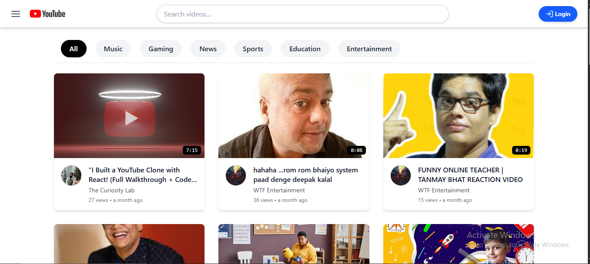
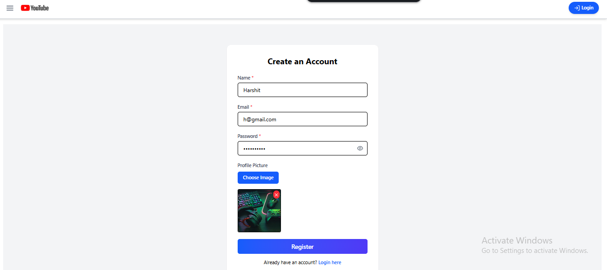
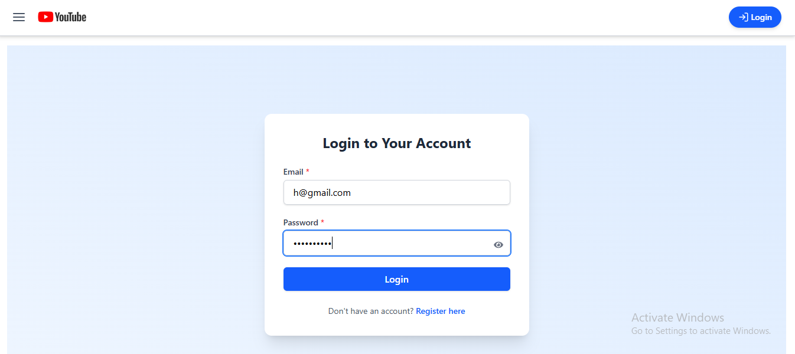
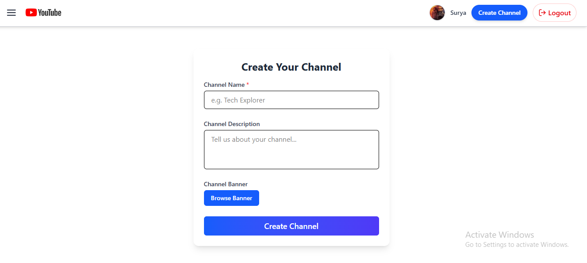
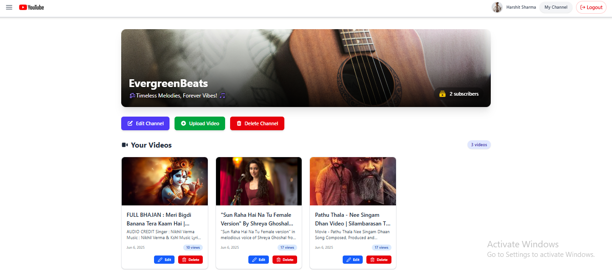
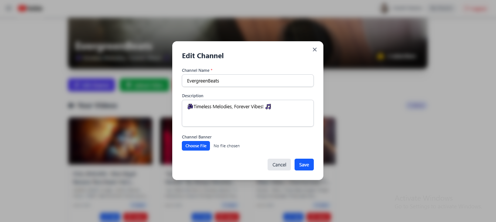
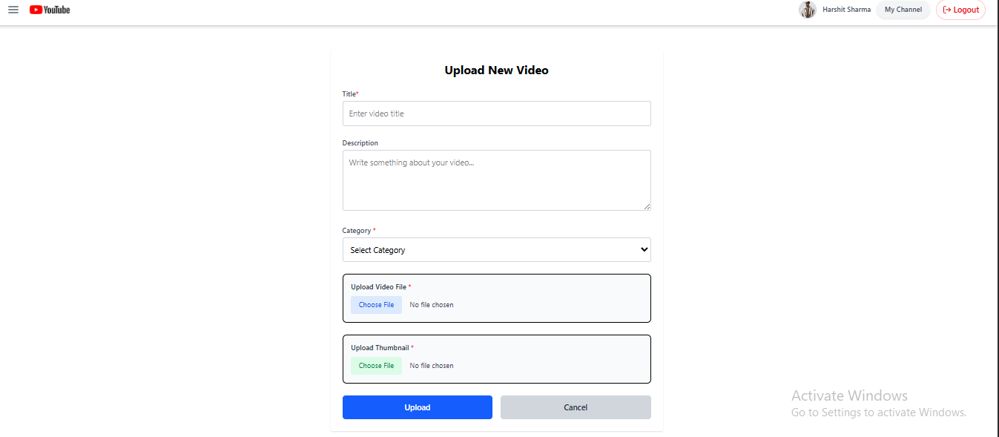
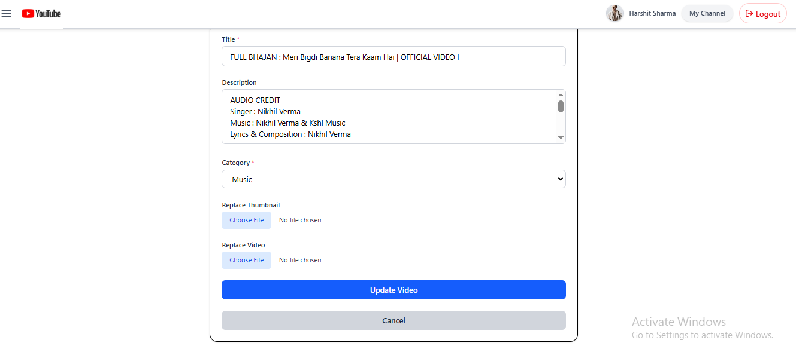
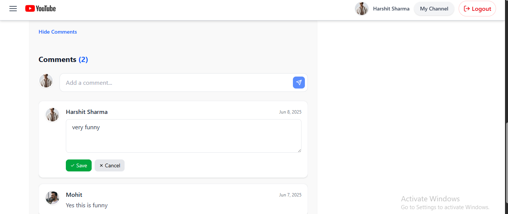

# 🎬 YouTube Clone – Full Stack Project

A full-featured YouTube Clone built with the **MERN Stack**: MongoDB, Express, React, and Node.js, using Cloudinary for media storage, Redux Toolkit for state management, and Tailwind CSS for styling.

---

## 🎥 Demo Video

Watch a real video hosted via Cloudinary:

🔗 [Watch Demo](https://res.cloudinary.com/dqtucqury/video/upload/v1749326810/youtube-clone/videos/wv0pvzd2546cyytobbii.mp4)

---

## 🔗 Live Demo & Source Code

🌐 **Frontend**: [https://mytubefrontend.vercel.app](https://mytubefrontend.vercel.app)  
🔧 **Backend**: [https://mytube-backend-7438.onrender.com](https://mytube-backend-7438.onrender.com)  
💻 **GitHub**: [YouTube-Clone Repository](https://github.com/sharmaHarshit2000/YouTube-Clone)

---

## 📦 Tech Stack

### 🌐 Frontend
- **React 19** (with Vite)
- **Redux Toolkit** – Global state management
- **Tailwind CSS** – Utility-first styling
- **Axios** – HTTP requests
- **React Router DOM**

### 🛠 Backend
- **Node.js + Express** – RESTful APIs
- **MongoDB + Mongoose** – NoSQL database
- **Cloudinary** – Video, thumbnail, and image storage
- **Multer + Streamifier** – File uploads
- **JWT & bcrypt** – Authentication & security
- **dotenv** – Environment variable handling

---

## ✨ Features

- 🔐 **JWT-based Authentication**
- 👤 **Channel Management** (Create, Edit, Delete)
- 🎥 **Video Uploading with Thumbnails**
- 📺 **Video Streaming & Player**
- 💬 **Comment System** (Add, Edit, Delete)
- 👍 **Like/Dislike Feature**
- 🔍 **Search and Filter Videos**
- 📲 **Fully Responsive Design**
- 📂 **User’s Dashboard: My Channel**
- 🔁 **Subscribe/Unsubscribe to Channels**

---

## 🧾 .env Configuration

### 📁 Frontend – `frontend/.env`

```
VITE_API_URL=https://mytube-backend-7438.onrender.com/api
# or for local dev:
# VITE_API_URL=http://localhost:5000/api
```

### 📁 Backend – `backend/.env`

```
PORT=5000
MONGO_URI=mongodb://localhost:27017/youtubeClone
JWT_SECRET=my_secure_jwt_secret

CLOUDINARY_CLOUD_NAME=your_cloud_name
CLOUDINARY_API_KEY=your_cloudinary_api_key
CLOUDINARY_API_SECRET=your_cloudinary_api_secret
```

---

## 🧱 Folder Structure

<details>
<summary>Click to Expand</summary>

```
yotube-clone/
├── backend/
│   ├── config/
│   │   ├── cloudinary.js
│   │   └── db.js
│   ├── controllers/
│   │   ├── authController.js
│   │   ├── channelController.js
│   │   ├── commentController.js
│   │   └── videoController.js
│   ├── middleware/
│   │   ├── authMiddleware.js
│   │   ├── errorMiddleware.js
│   │   └── multer.js
│   ├── models/
│   │   ├── User.js
│   │   ├── Channel.js
│   │   ├── Video.js
│   │   └── Comment.js
│   ├── routes/
│   │   ├── authRoutes.js
│   │   ├── channelRoutes.js
│   │   ├── commentRoutes.js
│   │   └── videoRoutes.js
│   ├── .env
│   ├── server.js
│   └── package.json
├── frontend/
│   ├── node_modules/
│   ├── public/
│   │   └── react.svg
│   ├── src/
│   │   ├── assets/
│   │   ├── components/
│   │   │   ├── ChannelInfo.jsx
│   │   │   ├── CommentSection.jsx
│   │   │   ├── CommentsToggle.jsx
│   │   │   ├── CreateChannelForm.jsx
│   │   │   ├── DescriptionToggle.jsx
│   │   │   ├── EditChannelModal.jsx
│   │   │   ├── EditVideoForm.jsx
│   │   │   ├── FilterBar.jsx
│   │   │   ├── Header.jsx
│   │   │   ├── Layout.jsx
│   │   │   ├── LikeDislikeButtons.jsx
│   │   │   ├── Loader.jsx
│   │   │   ├── Sidebar.jsx
│   │   │   ├── SuggestedVideos.jsx
│   │   │   ├── VideoCard.jsx
│   │   │   ├── VideoCardWithActions.jsx
│   │   │   └── VideoPlayer.jsx
│   │   ├── features/
│   │   │   ├── auth/
│   │   │   │   ├── authAPI.js
│   │   │   │   └── authSlice.js
│   │   │   ├── channel/
│   │   │   │   ├── channelAPI.js
│   │   │   │   └── channelSlice.js
│   │   │   ├── comments/
│   │   │   │   ├── commentAPI.js
│   │   │   │   └── commentSlice.js
│   │   │   ├── search/
│   │   │   │   ├── searchAPI.js
│   │   │   │   └── searchSlice.js
│   │   │   ├── ui/
│   │   │   │   └── uiSlice.js
│   │   │   └── video/
│   │   │       ├── videoAPI.js
│   │   │       └── videoSlice.js
│   │   ├── hooks/
│   │   ├── pages/
│   │   │   ├── ChannelPage.jsx
│   │   │   ├── CreateChannel.jsx
│   │   │   ├── EditVideoPage.jsx
│   │   │   ├── Home.jsx
│   │   │   ├── Login.jsx
│   │   │   ├── NotFound.jsx
│   │   │   ├── Register.jsx
│   │   │   ├── UploadVideo.jsx
│   │   │   └── VideoWatchPage.jsx
│   │   ├── router/
│   │   │   └── AppRouter.jsx
│   │   ├── utils/
│   │   │   ├── axiosInstance.js
│   │   │   └── formatDuration.js
│   │   ├── App.jsx
│   │   ├── index.css
│   │   ├── main.jsx
│   │   └── store.js
│   ├── .gitignore
│   ├── eslint.config.js
|   ├── .env
│   └── index.html
```

</details>

---

## 📸 Screenshots

### 🏠 Home Page


### 📺 Video Watch Page


### 📝 Register Page


### 🔐 Login Page


### 🆕 Create Channel Page


### 👤 Channel Page


### ✏️ Edit Channel Page


### 🎬 Upload Video Page


### ✏️ Edit Video Page


### 💬 Comment Section



---

## 🚀 Getting Started

### 🖥️ Backend Setup

```bash
git clone https://github.com/sharmaHarshit2000/YouTube-Clone.git
cd YouTube-Clone/backend
npm install
npm run start
# Runs on http://localhost:5000
```

### 💻 Frontend Setup

```bash
cd ../frontend
npm install
npm run dev
# Runs on http://localhost:5173
```

---

## 📡 API Endpoints Overview

### 🔐 Auth – `/api/auth`
| Method | Endpoint    | Description                         |
|--------|-------------|-------------------------------------|
| POST   | /register   | Register a new user                 |
| POST   | /login      | Login user                          |
| GET    | /me         | Fetch authenticated user details    |

### 🎥 Videos – `/api/videos`
| Method | Endpoint         | Description                        |
|--------|------------------|------------------------------------|
| GET    | /                | Get all videos                     |
| GET    | /search          | Search videos                      |
| GET    | /user            | Get user’s videos                  |
| GET    | /:id             | Get video by ID                    |
| POST   | /upload          | Upload new video                   |
| PUT    | /:id             | Update video                       |
| DELETE | /:id             | Delete video                       |
| POST   | /:id/like        | Like/unlike video                  |
| POST   | /:id/dislike     | Dislike/remove dislike             |
| PATCH  | /:id/views       | Increment view count               |

### 💬 Comments – `/api/videos/:videoId/comments`
| Method | Endpoint                        | Description               |
|--------|---------------------------------|---------------------------|
| POST   | /                               | Add comment               |
| GET    | /                               | Get comments for video    |
| PUT    | /:commentId                     | Edit comment              |
| DELETE | /:commentId                     | Delete comment            |

### 📺 Channels – `/api/channels`
| Method | Endpoint        | Description                    |
|--------|-----------------|--------------------------------|
| POST   | /               | Create a new channel           |
| GET    | /:id            | Get channel by ID              |
| PUT    | /:id            | Update channel info            |
| DELETE | /:id            | Delete channel                 |
| POST   | /:id/subscribe  | Toggle subscription            |

---

## 🙋‍♂️ Author

**Harshit Sharma**  
GitHub: [@sharmaHarshit2000](https://github.com/sharmaHarshit2000)

---

## ⭐ Like the project?
If you find this project helpful, consider giving it a ⭐ on GitHub!
